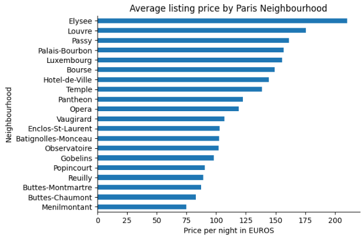
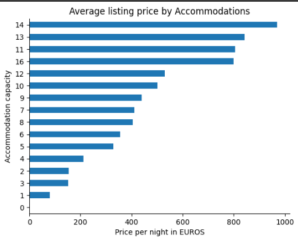
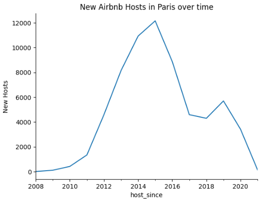
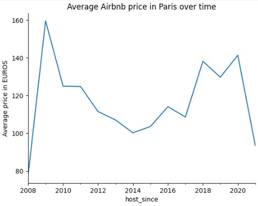
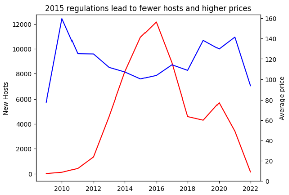

# **Airbnb Listing Analysis**

## Overview
This repository contains an exploratory data analysis (EDA) of Airbnb listings, utilizing Python libraries such as Pandas, Matplotlib, and Seaborn. The analysis aims to extract meaningful insights regarding pricing trends, availability, and other key factors affecting Airbnb listings.

## Features
- Price Distribution Analysis: Understand how prices vary across different locations.
- Availability Trends: Explore patterns in availability based on time and location.
- Feature Correlations: Identify relationships between price, number of reviews, and other variables.
- Visualizations: Use plots and charts to effectively communicate findings.

## Tech Stack 
- Python
- Jupyter Notebook
- Pandas for data manipulation
- Matplotlib & Seaborn for visualization

## Dataset Source
- Source: [Kaggle Link](https://www.kaggle.com/datasets/auswalld/airbnb-listing-analysis-dataset)

## Installation & Usage
1. Clone the repository:
    ```bash
    git clone https://github.com/Snack73/airbnb-listings-analysis.git
    ```

2. Navigate to the project folder:
    ```bash
    cd airbnb-listings-analysis
    ```
    
3. Install dependencies:
    ```bash
    pip install -r requirements.txt
    ```

4. Open the Jupyter Notebook:
    ```bash
    jupyter notebook airbnb_listings_analysis.ipynb
    ```

5. Run the notebook cells to explore insights.

## Data Visualizations

- **Average listing price by Neighbourhood**



- **Average listing price by Accommodations**



- **New airbnb hosts over time**



- **Average airbnb price over time**



- **Comparative visuals according to the 2015 regulations**




## Contributing

Contributions are welcome! Feel free to fork the repository, submit issues, or create pull requests to improve the analysis.

## License

This project is licensed under the MIT License.
